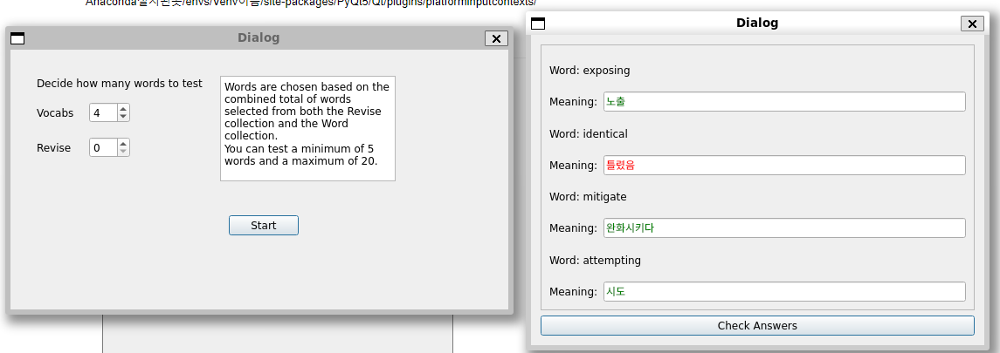

# test_dict
단어장 프로그램 개발

### pyqt5 qlineedit 한글 입력 오류 문제

1. pyqt5내에 한글 입력이 안됨
2. 문제 해결을 위해 wsl2 locale, 언어설정등을 확인 -> 한글 입력이 잘 되는 것을 확인
3. fcitx ibus kime등으로 한글 입력기 변경했으나 여전히 실패
4. PyQt5의 파일 경로 확인결과 두 개의 경로가 있음을 발견 그 중 /usr/local에 fcitx 공유 라이브러리 파일이 없음을 확인

### 해결
/usr/lib/x86_64-linux-gnu/qt5/plugins/platforminputcontexts/lib에 있는 언어 관련 공유라이브러리 파일들을
/usr/local/lib/python3.8/dist-packages/PyQt5/Qt5/plugins/platforminputcontexts로 옮겨서 해결

